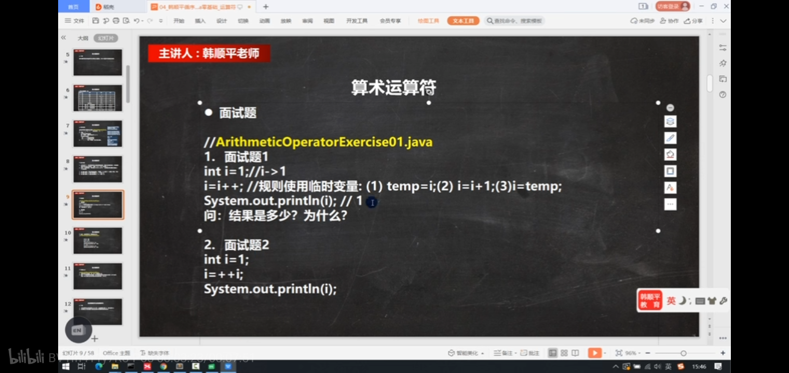
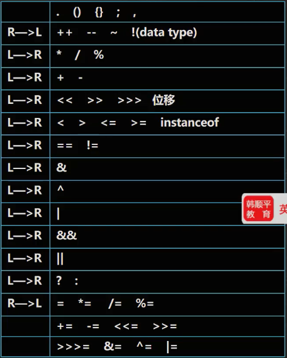
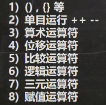
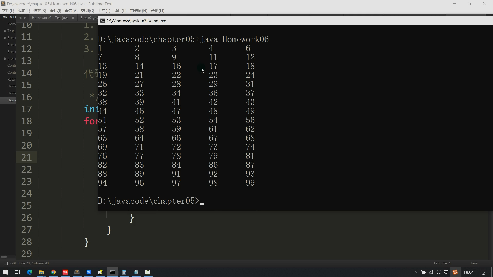
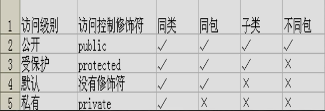

# 初步学习视频

- 因为我关注了一些up，是做c++的算法题。所以我的C++教程也可以下载保留下来，留待以后用（防止被撤回，或许可以自己上传视频）；

[2020最新_C++全套教程](https://www.bilibili.com/video/BV12a4y1W7iW?p=8&spm_id_from=pageDriver)

1. 现在想不起来的C的知识点：static修饰的变量。const修饰的变量。
2. 现在看的第一遍不想记笔记，本打算直接看书，不记笔记了。但是发现好多之前视频中讲了一遍没记住的知识点。所以之后看第二第三编视频的时候，还是需要记笔记的。（记那种用得少的知识点）

# 保留的问题

1. 面试题1 不是很理解

   

2. \r 的作用忘记了

   ```java
   public class Conert{
   	public static void main(String[] args){
   		char c1='\n';
   		char c2='\t';
   		char c3='\r';
   		char c4='\\';
   		char c5='1';
   		char c6='2';
   		char c7='3';
   		System.out.println("聂健在听课\r晚自习");
   		System.out.println(c2);
   		System.out.println(c3);
   		System.out.println(c4);
   		System.out.println(c5);
   		System.out.println(c6);
   		System.out.println(c7);
   		System.out.println("-----");
   	}
   }
   ```

   - 视频中空了好多行，而我只空了2行。而且我的推断也是两行
   
3. P102-5:20 ++i+i;  这个在c中大概听过，可能是错的。但是这里没有错。

   这样的听不懂的，记录下来，以后再琢磨、请教别人。

4. bite b = 1;  short s = b + 1; --  讲过一个只是点：（short\bite ）不能和char转换

5. P118-18:07   如果表达式 是 int型  ；而比较的时候是 double，那么还会转换比较成功吗？ int num;    switch(num)      case 1.1:   会成功吗；如果反过来：double num;   switch(num)  case 1;?第二个疑问不可能发生，因为表达式的类型有规定。

6. P185-2:00 本章作业，中的几个string还不太了解

7. P187-定位不太熟练。没有想到为什么

# 重点内容

1. 自动类型转换中byte、short、char运算时自动转化为int

# 记忆内容

1. 逻辑异或：异 就是  真  
   按位异或：异 就是 1    

2. 基本数据类型转换

   

3. 运算符优先级

   

   

4. P146-12:30 continue的跳转控制，有些陌生。

5. C++和Java没有printf("%02d",n); 这样的对齐格式。然而在之前遇到过%.s的C++代码。在Java中，也有 print(n+"\t") ：

   
   
6. 猴子吃桃那题

7. 迷宫那题

8. 快捷键：

   1. 快速格式化 - ctrl+alt+l
   2. 快速复制当前行 - 未知
   
9. 

   [访问修饰符](https://blog.csdn.net/qq_41998938/article/details/88979734)：这篇文章介绍得挺详细得

# 已经解决的问题

1. java中汉字字符变量存储

   1. //  C++中  char ch='男'; 为什么汉字存储需要两个字符，而单字节的 ch 变量就能存储
      #include<cstdio>
      int main() {
      	char ch = '男';
      	putchar(ch);
      	return 0;
      }

   2. ```java
      short s1 = 10;
      s1 = s1 + 10; //①
       
      short s2 = 10;
      s2 += 10; //2 ②
       
       
      答：①会出现编译错误 原因 s1+10的结果是int型转short型 属于大到小 所以不可以 解决：加强制类型转换(小数时会有数据丢失)
      ②正常运行 因为s2+=10复合赋值运算符会自动进行类型转换（强制）
      ```

      - 第二个不是简单等于C语言中的复合运算符。而是相当于 s2=( int )(s2 + 10); 

   3. 原理 Java中最小存储单元是字节(1k=8bit) char是Unicode编码，基本数据类型中char占两个字节(即16位)，一个汉字也是两个字节所以能存储的。

      

      

# 视频中可以整理的算法模板

1. P80-3:51   三个数求最大值，三目运算符的方法。
2. P119- 6:00 60分以下和以上的另一种判断
3. p148- 算法练习中的过路口，和曾经蓝桥杯中跑步的那题类似。
4. 123

