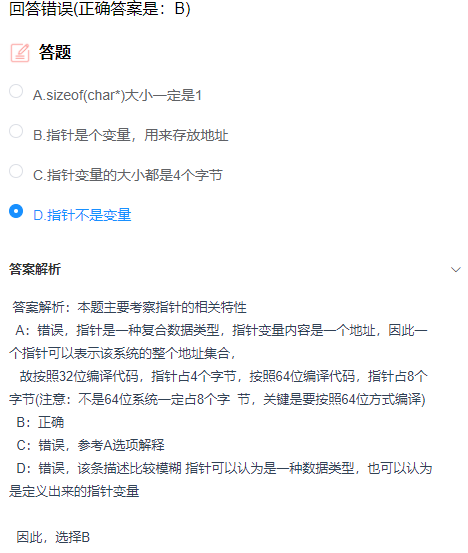

1. 指针

   

2. 改变循环变量

   ```c++
   int main() {
   	int i = 0;
   	int count = 0;
   	for (i = 1; i <= 100; i++) {
   		int num = 0;
   		num = i;
   		while (num) {
   			if (num % 10 == 9)
   				count++;
   			num /= 10;
   		}
   		/*while (i) {
   			if (i % 10 == 9)
   				count++;
   			i /= 10;// 不能在循环内部改变循环变量
   		}
   		*/
   	}
   	printf("%d", count);
   	return 0;
   }
   ```

3. 满足条件没有break

   ```c++
   int main() {
   	int arr[10] = { 1,2,3,4,5,6,7,8,9,10 };
   	int left = 0, right = 9;
   	int x = 4;
   	while (left <= right) {
   		int mid = (left + right) / 2;
   		if (arr[mid] == x) {
   			printf("%d", mid);// 这里如果是输出的话，必须加break；如果是return，则不用
   			break;
   		}
   		else
   			if (arr[mid] < x)
   				left = mid + 1;
   			else
   				right = mid - 1;
   	}
   	if (left > right)// 如果是return 就不用if判断
   		printf("No found");
   	return 0;
   }
   ```

4. 错题集