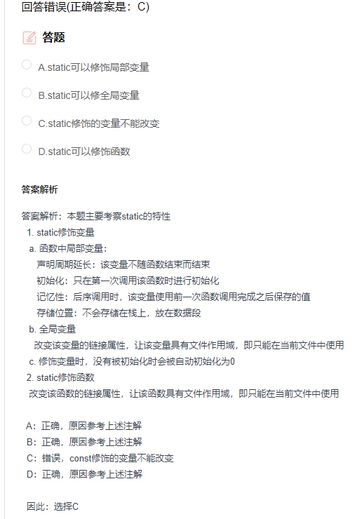

1. 关键字-static

   

2. 对三个数进行排序

   ```c++
   /*
   思路：
   该题比较简单，参考代码
   */
   #include <stdio.h>
   int main()
   {
       int a = 2;
       int b = 3;
       int c = 1;
         scanf("%d%d%d",&a, &b,&c);
       if(a<b)
       {
           int tmp = a;
           a = b;
           b = tmp;
       }
       if(a<c)
       {
           int tmp = a;
           a = c;
           c = tmp;
       }
       if(b<c)
       {
           int tmp = b;
           b = c;
           c = tmp;
       }
       printf("a=%d b=%d c=%d\n", a, b, c);
       return 0;
   }
   ```

3. 求两数最大公约数

   ```c++
   /*
   最大公约数：即两个数据中公共约数的最大者。
   求解的方式比较多，暴力穷举、辗转相除法、更相减损法、Stein算法算法
   此处主要介绍：辗转相除法
    
    
   思路：
   例子：18和24的最大公约数
   第一次：a = 18  b = 24  c = a%b = 18%24 = 18
         循环中：a = 24   b=18
   第二次：a = 24   b = 18  c = a%b = 24%18 = 6
         循环中：a = 18   b = 6
    
    
   第三次：a = 18   b = 6   c=a%b = 18%6 = 0
     循环结束
     
   此时b中的内容即为两个数中的最大公约数。
   */
    
    
   int main()
   {
   	int a = 18;
   	int b = 24;
   	int c = 0;
    
   	while(c=a%b)
   	{
   		a = b;
   		b = c;
   	}
    
   	printf("%d\n", b);
   	return 0;
   }
   ```

4. 判断素数

   ```c++
   /*
   思路：
   素数：即质数，除了1和自己之外，再没有其他的约数，则该数据为素数，具体方式如下
   */
    
    
   //方法一：试除法
   int main()
   {
   	int i = 0;
   	int count = 0;
    
    
       // 外层循环用来获取100~200之间的所有数据，100肯定不是素数，因此i从101开始
   	for(i=101; i<=200; i++)
   	{
   		//判断i是否为素数：用[2, i)之间的每个数据去被i除，只要有一个可以被整除，则不是素数
   		int j = 0;
   		for(j=2; j<i; j++)
   		{
   			if(i%j == 0)
   			{
   				break;
   			}
   		}
           
   		// 上述循环结束之后，如果j和i相等，说明[2, i）之间的所有数据都不能被i整除，则i为素数
   		if(j==i)
   		{
   			count++;
   			printf("%d ", i);
   		}
   	}
    
    
   	printf("\ncount = %d\n", count);
   	return 0;
   }
    
    
   //上述方法的缺陷：超过i一半的数据，肯定不是i的倍数，上述进行了许多没有意义的运算，因此可以采用如下
   // 方式进行优化
   // 方法二：每拿到一个数据，只需要检测其：[2, i/2]区间内是否有元素可以被2i整除即可，可以说明i不是素数
   int main()
   {
   	int i = 0;//
   	int count = 0;
    
    
   	for(i=101; i<=200; i++)
   	{
   		//判断i是否为素数
   		//2->i-1
   		int j = 0;
   		for(j=2; j<=i/2; j++)
   		{
   			if(i%j == 0)
   			{
   				break;
   			}
   		}
   		//...
   		if(j>i/2)
   		{
   			count++;
   			printf("%d ", i);
   		}
   	}
    
    
   	printf("\ncount = %d\n", count);
   	return 0;
   }
    
    
    
    
   /*
   方法二还是包含了一些重复的数据，再优化：
   如果i能够被[2, sqrt(i)]之间的任意数据整除，则i不是素数
   原因：如果 m 能被 2 ~ m-1 之间任一整数整除，其二个因子必定有一个小于或等于sqrt(m)，另一个大于或等于 sqrt(m)。
   */
   int main()
   {
   	int i = 0;
   	int count = 0;
    
    
   	for(i=101; i<=200; i++)
   	{
   		//判断i是否为素数
   		//2->i-1
   		int j = 0;
   		for(j=2; j<=sqrt(i); j++)
   		{
   			if(i%j == 0)
   			{
   				break;
   			}
   		}
   		//...
   		if(j>sqrt(i))
   		{
   			count++;
   			printf("%d ", i);
   		}
   	}
    
    
   	printf("\ncount = %d\n", count);
   	return 0;
   }
    
    
   //方法4
   /*
   继续对方法三优化，只要i不被[2, sqrt(i)]之间的任何数据整除，则i是素数，但是实际在操作时i不用从101逐渐递增到200，因为出了2和3之外，不会有两个连续相邻的数据同时为素数
   */
    
    
   int main()
   {
   	int i = 0;
   	int count = 0;
    
    
   	for(i=101; i<=200; i+=2)
   	{
   		//判断i是否为素数
   		//2->i-1
   		int j = 0;
   		for(j=2; j<=sqrt(i); j++)
   		{
   			if(i%j == 0)
   			{
   				break;
   			}
   		}
   		//...
   		if(j>sqrt(i))
   		{
   			count++;
   			printf("%d ", i);
   		}
   	}
    
   	printf("\ncount = %d\n", count);
   	return 0;
   }
   ```

5. 