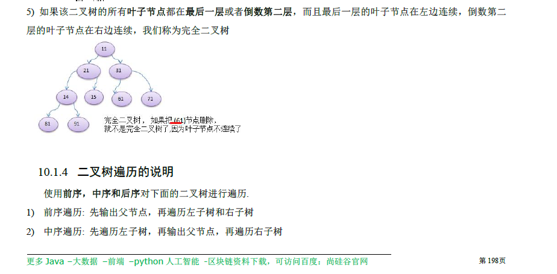

1. 
   n个节点的完全二叉树，最多可以有多少层 .log(n)+1(向下取整) 
   
   

# 课时：2021-09-28_101期Java_二叉树02

1. #### [144. 二叉树的前序遍历](https://leetcode-cn.com/problems/binary-tree-preorder-traversal/)：有三种方法，第一种第三种都是遍历思想。第四种体现思路：子问题思路。

