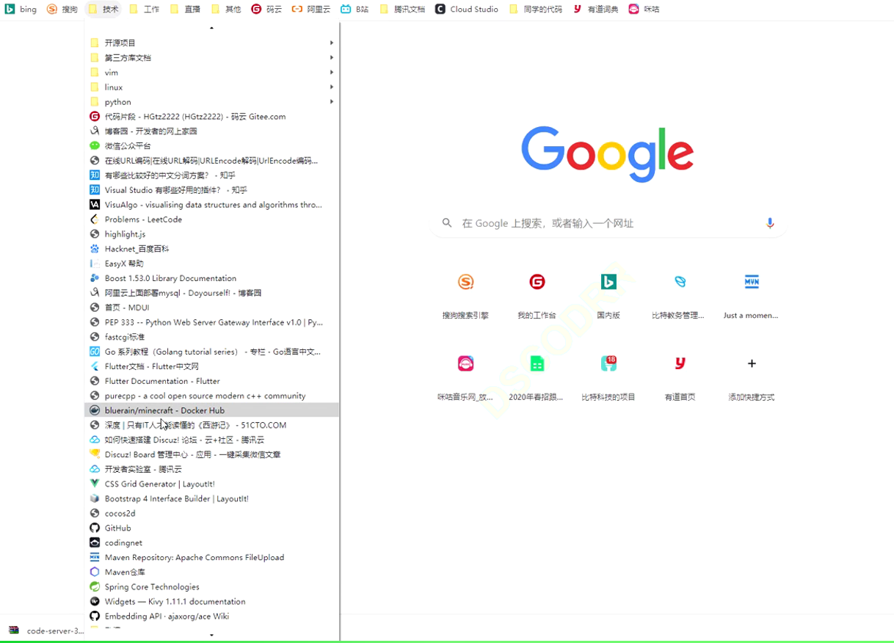

# JavaWeb

## 一：线程不安全

1. 三种不安全得情况
   1. 抢占式执行
   2. 执行不是原子的(使用锁来保证原子性)
      1. 除了 自增 操作 、+=等 也不是原子的。而内置类型直接复制 = 需要看 64位CPU还是32位，引用类型不一定是原子的。为了保险起见，该加锁就加锁。
   3. 多个线程尝试修改同一个变量，关键字：多个、同一、修改。(或者一个线程读取数据、一个线程修改数据)
   4. 内存可见性 - 即编译器优化生效，内存是可见的（其他线程修改了内存，当前线程可以看到内存的变化。
      1. 当单个线程中反复执行一个内存中的变量，并且没有对其进行修改。编译器会将这个变量存储在寄存器中(因为寄存器访问速度快).这样的优化符合了编译器优化的原则，即优化后前后逻辑没有改变。但是编译器并不能观察到其他线程的操作。如果其他线程改变这个内存中的变量，其他线程看不见。
   5. 指令重排序

## 二：synchronized 关键字 - 解决 执行不是原子的(使用锁来保证原子性)

1. 如果一个线程出错，由于synchronized，其他线程会一直阻塞状态。（常常遇到，这是 死锁 的现象）
   重启 常常用来解决死锁(哲学家问题)

2. 复习前面的知识：

   1. |            |               |           |           |                                |
      | ---------- | ------------- | --------- | --------- | ------------------------------ |
      | 线程安全   | StringBuffer  | Vector    | HashTable | 内部加了锁，线程安全           |
      | 线程不安全 | StringBuilder | ArrayList | HashMap   | 如果是单线程中，建议使用这一组 |

3. 所谓的加锁，是在指定对象 中加锁。即使是对方法进行加锁，其实质也是在this上加锁。创建一个对象时，除了给属性分配空间，还会添加的属性"对象头"--包含一个具体的字段。表示当前对象的加锁状态，未加锁时是false 加锁时true。一个线程进入对象，就将sychronized置为true 退出对象就置为false。

4. 可以对某个对象进行加锁。这时相当于将这个对象当作线程之间的钥匙，谁拿到这个钥匙谁就可以执行，执行完相应代码后，这个要是就返回到原位了，等待别的线程获取。
        sychronized (对象) {

   ​		// 操作

   ​	}

5. 稍微记一下（不确定的知识点）：对静态代码块加锁，就会对该类 对应的 类对象进行加锁。

6. 对 一个类 的 类对象 也可以进行加锁。

7. 锁不仅仅只有 sychronized，还有其他的。

# volatile关键字

1. 用于保证内存的可见性，即禁止编译器将内存中的变量放在寄存器(一个线程读内存数据，一个线程修改数据，修改的能成功但是读取的并不能看到修改结果)。
2. 使用方法：在变量声明时 添加 volatile  public volatile int flag = 1;
3. 到底编译器何时优化不清楚，为了保险所以加 volatile

# wait、notify关键字

1. 应用场景：由于线程的调度本来是完全由内核全权负责的，但是这样的抢占式执行可能带来问题--线程执行不下去，导致迟迟不释放锁、退不出线程。这两个关键字就能让程序员有一定的办法来干预线程调度。
2. wait需要先设置锁  因为 wait前 是需要将 锁释放，供其他线程获取（wait方法必须在 sychronized代码块中使用）
3. notify也要放在锁内
4. 使用锁的对象和wait方法的对象必须一致  、notify和wait的对象也必须一致
5. wait 本质做了三件事：1.释放锁 2.等待通知 3.尝试重新获取锁并继续执行。前两个事情是原子的(不太明白)，为了避免竞态条件问题。
6. wait首先释放锁，然后该线程在wait处退出，并等待获取锁的信息。别的线程获取锁，
   （notify应该只能在别的线程中出现)。notify在别的线程中执行后，wait得到
   可以执行的信息。等到notify的线程结束后，wait所处的线程尝试重新获取锁。
7. 竞态条件问题：有一种情况：wait释放锁后，线程2直接获取锁，并发出notify。线程2发出notify后，线程1才开始接收通知。
8. notigyAll: 是唤醒所有wait的线程。不建议使用。

## 不同多线程场景 对应不同解决方法

1. 一个线程读，一个线程写   volatile 解决 可见性问题(寄存器)
2. 两个线程同时 写  sychronized   解决原子性 问题。同意之间只能有一个线程获取内存的操作权

# 设计模式

#### 单例设计模式

1. 饿汉式 ：一旦被加载就实例化好一个对象
2. 懒汉式：调用getInstance，才实例化
3. 懒汉模式比饿汉式 效率高点。
2. 懒汉模式 的优化：懒汉式 线程不安全。其中 需要将  if (instance == null) 也要锁住。因为，如果在其他线程修改instance前 进行读取并判断，则获取锁后还会new。这里还能进行效率优化。在外部再加一个if (instance == null)。因为多个线程都会访问 instance ，防止编译器进行优化(将instance放入寄存器中)，将instance 前加 volatile。
5. 一个 疑问：饿汉式 是在加载的时候实例化对象。那么怎么保证加载只加载一次，而不是两个线程同时加载。

#### 生产者-消费者模式

1. 框架是队列。将队列满 和 队列空 更改 为线程 的阻塞状态。
2. 同时为了 线程安全 将两个操作 都加相同的 锁。
3. wait notify 各两对。分别 唤醒另一个操作中 的wait  这个对应关系 是由 逻辑判断的-两个操作只会有一个被阻塞。
4. size 一定要加 volatile 。至于 tail head 尽量加
5. 拓展思考：notify 能不能替换成 notifyAll  ？ 不能 假设有两个消费线程，只有一个生产线程。生产线程生产一个元素后，执行notifyAll。 其中一个消费线程获取锁并消费这个元素，然后释放锁，此时队列为空，另一个消费线程也获取锁，此时这个线程能够直接进入取元素的操作。 如果想替换，可以 将 if 判断 替换成 while
6. wait 尽量和 while 搭配  而不是 if

#### 工厂模式

1. 概念：当创建一个实例的时候，如果创建过程比较复杂，此时就可以把这个new操作封装到一个专门的静态方法内，由这个静态方法进行实例化和初始化。

#### 计时器

1. 老师代码中 加的锁 是 new的Object 。如果内部类引用外部类 this，是不是用 外部类名？

# 线程池

1. 其中 interrupt 和join  方法 的调用 不明白。
2. 第二个问题：线程池代码运行结果，顺序不确定，其中的原理是如何？
   目前答案：take()阻塞后，并不是在put(command)后就继续了。当多个线程都在阻塞时，到底哪个线程take成功，就会先由哪个线程执行接下来的 println 和 run() - 这一点可以从每一次第一个任务被执行时 任务号和线程号恰好对应。
3. 那么从问题二又引出一个问题：take()的阻塞什么时候才会被唤醒？

# IO

1. 如何既能显示当前目录下的 文件，又能 显示 内部目录的文件。 有待优化
2. bufferedWrite等流如果不调用.flush()方法，但是调用了.close()方法，也可以刷新缓冲区。
3. clientSocket.close()运行时，从中创建的流也会跟着关闭。

# 网络原理

1. 网络传输流程图：
   1. 应用层  
   2. 传输层
   3. 网络层
   4. 链路层
   5. 物理层
2. TCP核心特性
   1. 确认应答
   2. 超时重传
   3. 连接管理
      1. 建立连接
      2. 断开连接
   4. 滑块窗口
   5. 流量控制
   6. 阻塞控制
   7. 延迟应答
   8. 捎带应答
   9. 粘包问题
   10. 保活机制

---

# 汤众老师常用网站

# Tomcat

1. 作用：
   1. 静态页面 - html
   2. 动态页面 - servlet
   3. 1

----

#### Servlet编程需要的网站

1. Servlet[3.1](https://mvnrepository.com/artifact/javax.servlet/javax.servlet-api)版本
2. [mysql connector 5.1版本](https://mvnrepository.com/artifact/mysql/mysql-connector-java)

#### webapp项目创建步骤

1. 创建maven项目
2. 配置 pom.xml  - 在Maven网站中查找配置 
3. 数据库设计12

---

# 博客系统

1. 改进：这个系统是多线程吗？不是的话，[如何优化为多线程。](https://blog.csdn.net/qq_29331365/article/details/91438803)

## 想写的项目：

### 晨起语音播报

1. 闹钟 -- 结束闹钟后进行语音播报：
   1. 天气 - 可以详细到当天每个时间段的温度，也可以智能化“有巨大温度变化、天气转变时进行提醒”。
   2. 日历中的待做事情播报。（待做事情一般都有最早提醒时间，所以也可以播报之前设置的提醒事项）
   3. 播放邮箱中新的邮件。
   4. 日历中口述添加待做事情、进行计划。
   5. 播报当天课程表、股市、
   6. 智能化：可以口述重复播报某一个项目内容、提前终止、调节声音。

###### 考虑在工作的时候同时写博客。等35岁后可以靠这个。。。

# JVM

1. 疑问：静态变量指向的实例 是存在堆中的？ Test  t = new Test(); 

#### GC

1. GC是干嘛的。很大程度上避免内存的泄露，也不是完全避免。
2. gc回收那部分的内存 - 堆，方法区
3. 堆内存分为三部分，
4. fc基本指导方针，标记回收
5. 标记方法：
   1. 引用计数
   2. 可达性分析有向图，遍历图，能访问到的就不是垃圾
      1. 栈帧的局部变量
      2. 常量池指向的对象
      3. 静态变量指向的对象
   3. 方法区类卸载
      1. 类的所有实例都被回收
      2. 类加载器被回收
      3. 类对象没有被其他代码使用
      4. 三点全满足
   4. 回收的算法
      1. 标记清楚 ： 针对被标记的垃圾对象 直接删除
      2. 标记复制：搞另一个大的内存区域，把存活的对象拷贝到另外的取余，再整体释放原来区域。
         1. 用于新生代对象
      3. 标记整理
         1. 搬运更多，不适合频繁进行。
      4. 根据不同情况
   5. 垃圾回收（垃圾分类）
      1. 划分依据：根据对象的年龄
         1. 新生代：伊甸区，生存区
         2. 老年代
      2. 生于伊甸区，
      3. 一轮gc后，进入生存区

###### 相关术语

1. particial gc ： 

1