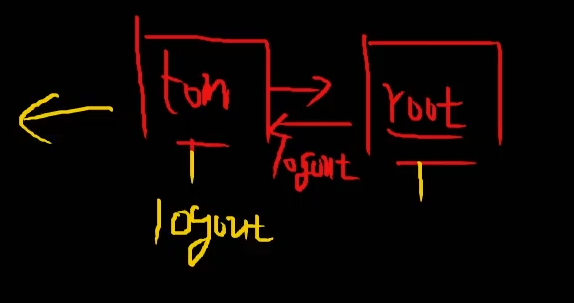
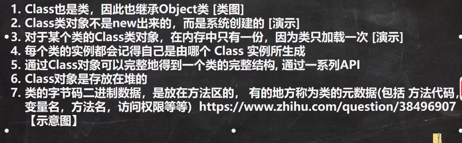
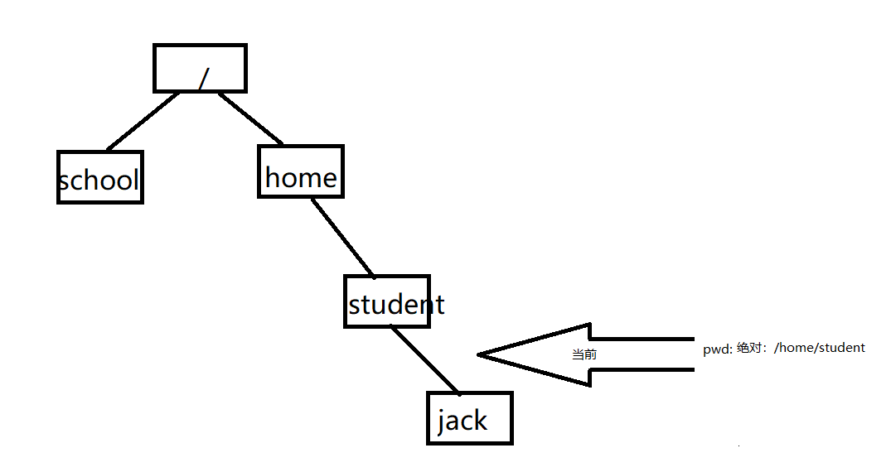
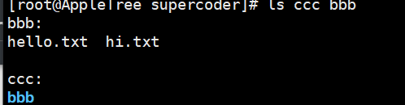
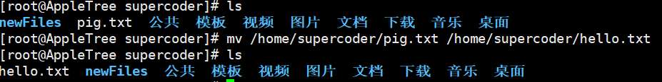

# Linux账户

root密码：N331150871
主机名：AppleTree
普通用户：SuperCoder（XShell中小写登录）
密码：N331150871
root用户：root
密码：N331150871
普通用户2：tom
密码：N331150871
普通用户2：fox
密码：N331150871

1. 单机虚拟机屏幕或Ctrl+G(不太会用)即可 使鼠标活跃在 虚拟机中。CTRL+alt 释放鼠标。

# 笔记

1. ls -lh /root/hello.txt    ：以人能阅读的方式显示文件信息。
2. zip -r myhome.zip /home/* 指的是只将home文件夹下的文件压缩，不包含home文件夹

# 指令

1. gcc -v ：查看是否安装gcc。安装标志：出现版本信息
2. ifconfig ：查看ip地址。inet 后面的数字
3. ping(windows平台也适用) ：检验两个ip（设备）能否链接通畅
4. su - root ：切换成系统管理员身份。 su - 用户名 ：切换到用户名所指的用户（低\同权限到高权限用户需要输入密码。反之不需要）
5. logout 注销用户 ：如果当前账户是由一个账户切换过来的，则logout会返回之前的账户。如果当前账户是第一次登录的账户，则logout会退出链接（XShell中）。
   logout 在图形界面中无效，适用于 运行级别 3(非图形界面)。应该用exit，exit退出终端，无法退出用户。
6. 
7. 第四点中，如果是new出来的对象，可以通过cls.getMethod来获取对应方法类型的对象吗

# 远程指令

1. reboot ：重启系统
2. vim/vi + 文档名 ：编辑文档，如果没有该文档就会创建一个。
3. 只输入 shutdown ：代表 shutdown -h 1 
4. shutdown -h 1 ：向所有远程登录Linux系统的用户发送通知："hello, 1分钟后会关机"
5. passwd 不输入任何用户名 ：默认是修改当前登录用户的密码 只能修改当前用户密码或依靠root修改其他用户密码
6. 用户删除不能删除自己，也不能删除别的用户。只能靠root用户删除。而且依靠切换用户的情况下，之前的用户并没有完全退出。所以也不要删除之前登录的用户。
7. 新增组、删除组等操作，需要在root用户下才能操作。
8. who am i / whoami ：查看当前登录的用户信息。
9. pwd ：当处于A文件下，未进入A文件下的B文件时，则显示当前路径为/home/A
10. 问题：切换目录的时候 cd /home/tom 最后需不需要加"/" ? cd /home/tom/  - 我自己的理解：加“/”：可以辨别是文件夹还是文件
11. rm ：可以用于删除touch创建的文件 选项-r是递归删除、-f是强制删除 可以对多个文件进行操作,多个文件之间用空格隔开
12. cd ：可以同时操作多个文件
    
13. mv ：将一个文件移动到当前文件，但是改变其名称，就是重命名操作。
    
14. mv ：移动到目标文件夹时不添加名称，就是不改变名称移动
15. mv ：整体移动文件夹时，如果目标最后一级文件夹不存在就会创建（最后一级文件夹都会帮助创建）
16. head ：head -n 中-n不是显示行数的选项。而是代表自定义显示前多少行，后面需要添加行数
17. tail -f ：监听停止的快捷键：Ctrl + C
18. date +%Y ：显示当前年份。+ 加号是需要添加的。
19. ls -lh ：h即human 按照人的习惯显示
20. 在命令行中，空格本身代表命令之间的间隔。需要加 " \ " 进行转义。
21. locate 是在 updatedb创建的数据库基础上进行定位的。如果文件有变化，则需要再次updatedb创建数据库，才能防止定位错误。
22. zip -r myhome.zip /home/* 和 zip -r myhome.zip /home/ 相同作用。都是压缩home及其目录下的文件
23. tar -zxcf ：解压命令后 先添加 source 再 添加 -C (大写) 最后添加destination。tar 命令中涉及到的文件必须是创建好的。最后一层未创建，也不会自动创建。
24. chmod ：第二种方式通过数字变更权限，不能改变单个组、用户的权限，即不能 o-2 。只能全部赋值 chmod 644 apple.txt
25. 可执行文件的运行： ./my.sh。在crontab -e编辑的时候，执行可执行文件的命令：
    */1 * * * * /home/supercoder/crond/my.sh
26. alt + enter：全屏

# Vim命令

1. i 、a、o、r ：进入编辑模式
2. esc ：返回一般模式
   1. 一般模式下的命令：
      1. 复制 ：yy 、5yy 。p 粘贴
      2. 删除 ：dd、4dd 。 
      3. G ：最末行   g ：最首行
      4. u ：撤销
      5. 20 + shift +g ：快速定位到20行
3. " : "、” / “ ：进入命令模式
   1. 命令模式下的命令： 
      1. wq ：保存退出、q ：退出 、q! ：强制退出
      2. 直接输入 关键字 ：回车-查找 、 输入 n - 查找下一个
      3. set nu ：显示行数  set nonu ：关闭行数
      4. 1