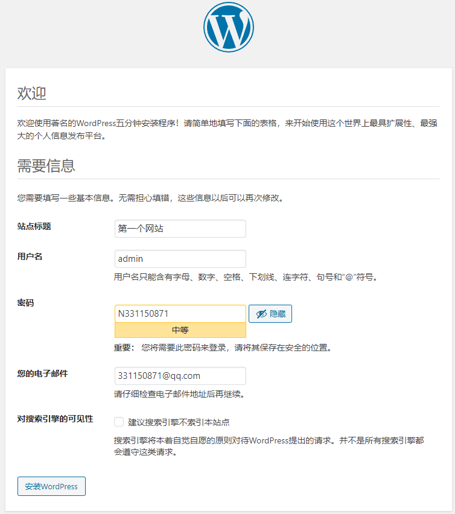

1. 实例用户名：root  密码：email

2. VNC登陆密码：Nj3311

3. 宝塔面板的：

   1. 宝塔查看命令 bt（root目录下）
   2. 外网面板地址: http://123.57.92.107:8888/b3331551
      内网面板地址: http://172.29.218.194:8888/b3331551
      //宝塔用户名username: 7yf0q40f
      password: 39039f4e

4. 宝塔账号：15101202998  密码：Nj331150871

5. wordpress 密码：N331150871

6. 数据库账号资料数据库名：**www_seeker_ink**

   |-用户名: SuperCoder
|-新密码: N3311
   

访问站点：http://www.seeker.ink/index.php

7. 

8. 目前使用的站点：数据库账号资料

   数据库名：**sql123_57_92_10**

   用户：**sql123_57_92_10**

   密码：**26Tb47Y5tT**

   访问站点：http://123.57.92.107/index.php

   wordpress登陆界面：http://123.57.92.107/wp-login.php

9. 

10. 