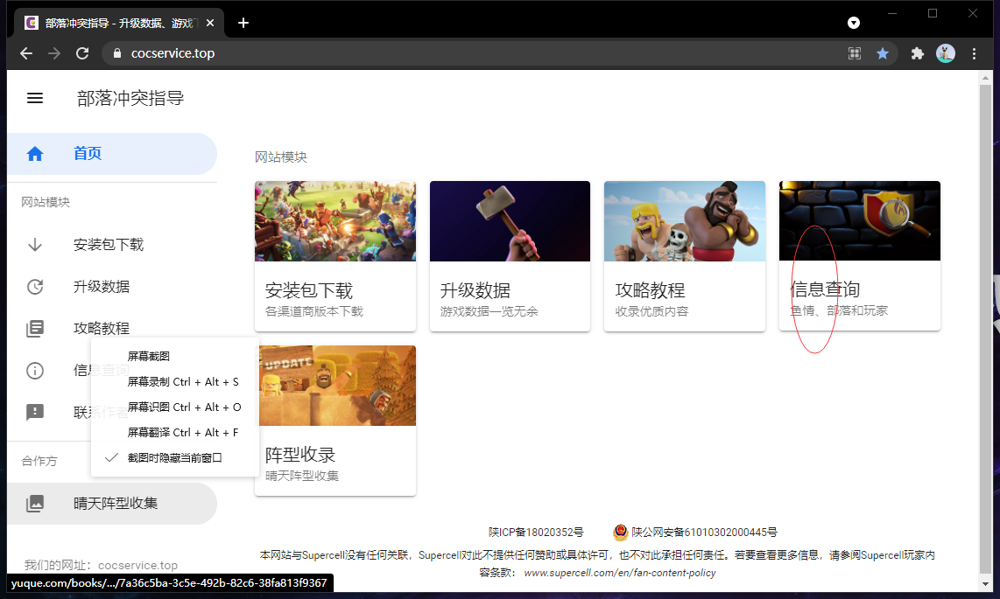

# 打资源的术语

1. 部落冲突 家乡守卫：当你被人打了就可以获得些许小时的护盾，这个护盾存在期间，别人不能打你。或者你在线的时候别人也不能打你（你也不能一直在线，每在线3小时，系统会强制你下线一段时间。）
2. 部落里你打的玩家都被称为“鱼”。资源多的玩家被称为“大鱼”，很久不上线而导致他的采集器都是满的，这种人称为“死鱼”。
   \3. 部落冲突是全球的玩家都可以搜到彼此，所以这就可能导致：当我们中国是白天的时候，美国人都睡觉了，他们都不在线，这样我们就可以打他们了。而我们中国人也是大多在中午、晚上在线，而且他们都在这个时候打资源，所以中午、傍晚这些时候都会很难搜到大鱼和死鱼（因为其他玩家也在搜）。
3. 因此，coc（部落冲突）就创造了一个数学建模模拟的“鱼情”。鱼情表示当前打资源的难易，分数越高越好打
4. 另外，鱼情好不代表你就好打资源，不同的大本等级适合在不同杯段(假设1000-1400杯)搜鱼。
5. 一般死鱼的质量最好，资源采集器内的资源可以掠夺75%。而金库等存储罐只能打最多20%，所以采集器才是掠夺资源的重要来源。死鱼的罐子里都是空的，而采集器大都放在最外面。而且，11本有天鹰火炮、地狱塔、连弩，这种防御建筑一旦时间长不在线，内部的弹药就消耗完了。更好打

## [鱼情网站](https://www.cocservice.top/)

# 部落战

# 联赛

# 部落竞赛