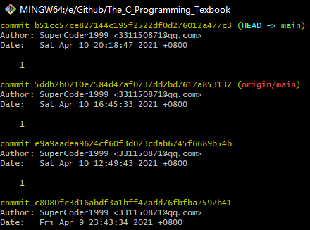
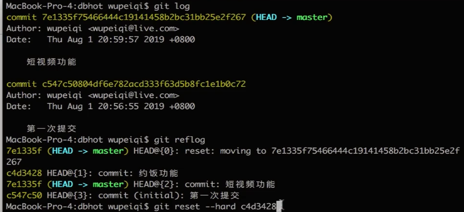
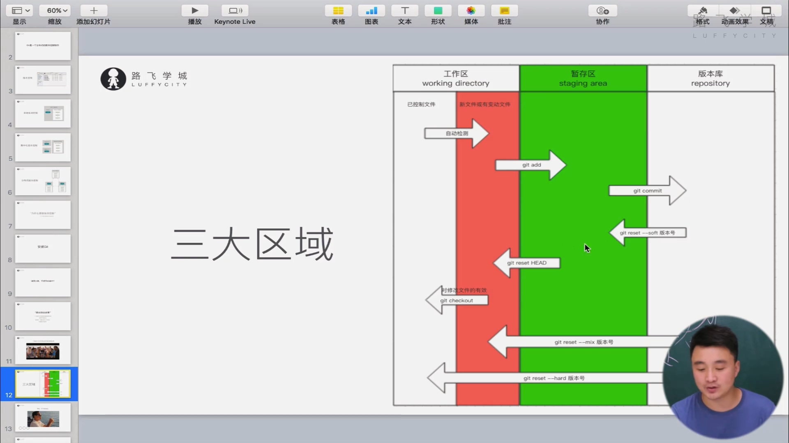

# 命令

## 零碎命令

1. git version    查看git的版本
   1. git --version 也行，具体什么原因暂且不知道
2. 7.7.07 介绍mac的操作
3. ctrl+l = clean  清屏

## 版本控制

### 用git管理文件夹大体步骤

1. 进入工作区）
2. 初始化工作区
3. 进行文件管理
4. 生成版本

### 个人信息配置

- 配置用户名、邮箱【一次即可】

```
git config --global user.email "邮箱"--引号可省略
git config --global user.name "用户名"--引号可省略
```

### 具体操作

1. 进入工作区

2. 初始化

   1. 命令：git init
   2. 结果：生成.git文件
      1. 拓展：.git 文件中存储着该文件夹下的配置和版本信息

3. 管理过程

   1. 检测文件夹的状态

      1. 命令：git status
      2. 现象：
         1. 红色文件名-工作区中新增的或修改的
         2. 绿色文件名-提交至暂存区的

   2. 筛选需要工作区的文件

      1. 命令：git add 文件名、git add . --全部文件夹被提交至暂存区
         1. 也可以加*变成通配符---暂时不知道干嘛的
      2. 效果：被添加到暂存区的文件名变绿

   3. 提交至版本库并生成版本

      1. 命令：git commit -m ' 信息'  也可以是引号 " 信息 "

   4. 查看版本信息

      1. 命令：git log

   5. 回滚版本

      1. 回滚一次版本

         ```
         git reset --hard 版本号
         ```

         - 版本号在版本信息中的commit后面

         

      2. 回滚到消失的版本（因为回滚所以在git log中查看不到）

         - 此时版本号需要另一个命令查找
           - 命令：git reflog

         1. 回滚命令
            1. git reset --hard 版本号
               - 版本号在版本信息的最前面

         

# 紧急bug修复

1. 10.10理论讲解
2. 操作命令
   1. 查看分支
      1. 命令：git branch
   2. 创建分支
      1. 命令：git branch dev 可加 ' ' 
         1. dev指的是development，即开发的分支
      2. 注意：
         1. 此时分支dev是处在master的分支上创建的分支，且dev指向了当前master上最新版本
   3. 切换分支
      1. 命令：git checkout dev
      2. 切换分支就是切换一个环境，在dev分支中开发时不影响master分支上的内容
         1. 示例：从master分支切换到dev分支进行修改，再生成版本，此时查看历史版本，会发现此次版本在dev分支上。切换回master分支，打开文件，文件没有被修改
   4. 合并分支（注意需要在master上-即在需要修改的分支上获取修改内容）
      1. 命令：git merge 分支名
   5. 删除分支
      1. 命令：git branch -d bug
3. 修复bug具体操作
   1. 在master分支上创建一个bug分支（dev分支上已经形成版本的内容就会被暂且搁置。具体需不需要在切换分支前生成版本暂时不清楚）
      1. 命令：git branch bug
   2. 切换到bug分支上，修改bug分支目前的文件（文件状态和master上（最新版本）一样）
   3. 切换回master分支，合并。
      1. 命令：git merge bug
   4. 删除分支
4. 继续开发新功能
   1. 此时发现，dev分支下的文件中没有修复bug的内容。不用在意，这条分支仅仅用于开发新功能。（如果必须在修复了bug的基础上进行开发，可在dev分支上合并master即可）
   2. 继续开发，直到完成
5. 将开发的内容合并到master
   1. 切换回master分支  git checkout master
   2. 合并  git merge dev
   3. 此时会产生冲突---有个软件能解决冲突
      1. 原因是因为，master分支已经被修改了，和dev当时被创建时不一样。也或许因为，dev修改的那行在master中也修改了，此时不确定哪一个是最新版本。
      2. 冲突会在文件中具体显示，手动修改即可。
         1. 将冲突的地方进行修改
         2. 再将出现冲突标记的标记语言删除
      3. 解决完冲突，进行git add . ----git commit -m ’结局冲突‘ 

### git 操作对应专业术语

1. 6.6.06视频中介绍



图片中checkout的文字说明是：对修改的文件有效

- 举例git checkout 从工作区红色返回以控制状态

  ```
  git checkout --文件名
  ```

  - 效果：修改后的文件又回到已经被管理时的样子。仅仅在工作区内切换

- 举例git reset HEAD

  ```
  git reset HEAD 文件名
  ```

  - 效果：从暂存区（绿色）状态回到工作区（红色）状态


# 工作流

1. 工作规范：至少有两个分支
   1. master---永远是已经确定的版本
   2. dev--在上面开发
2. 


