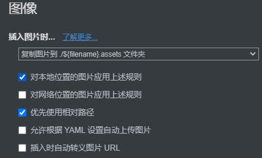
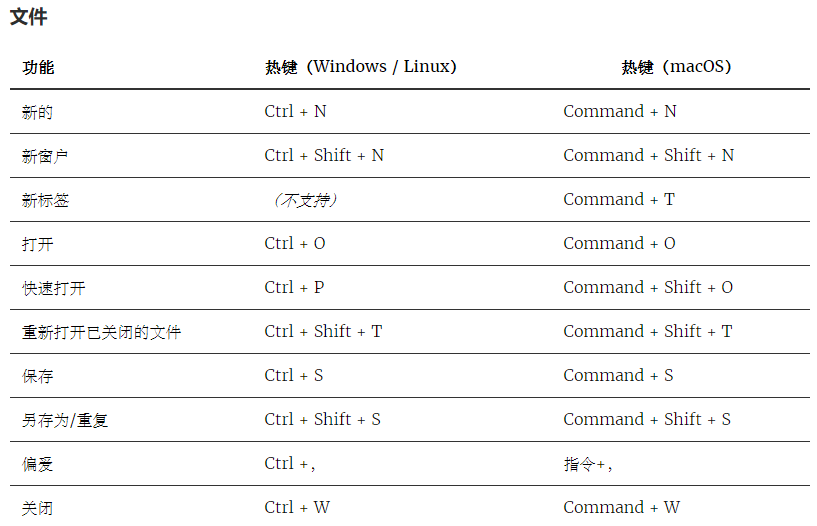
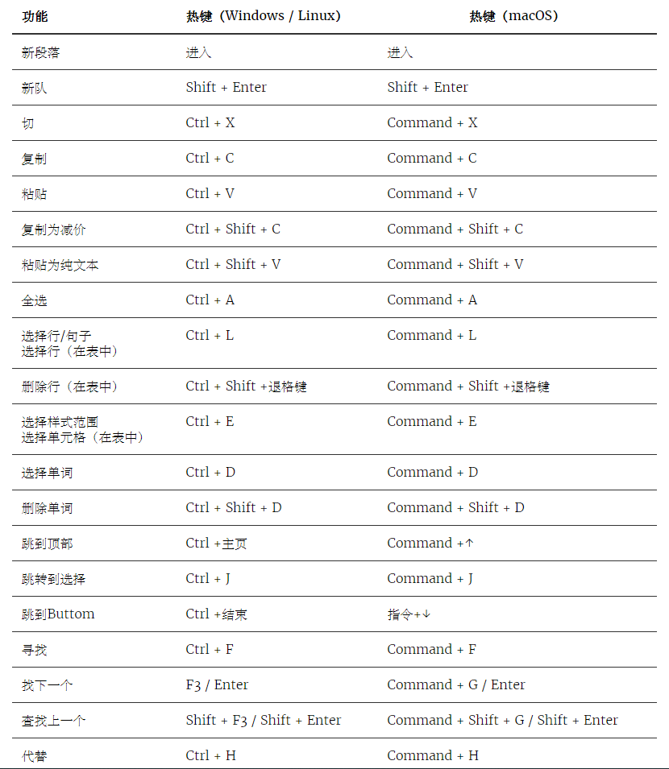
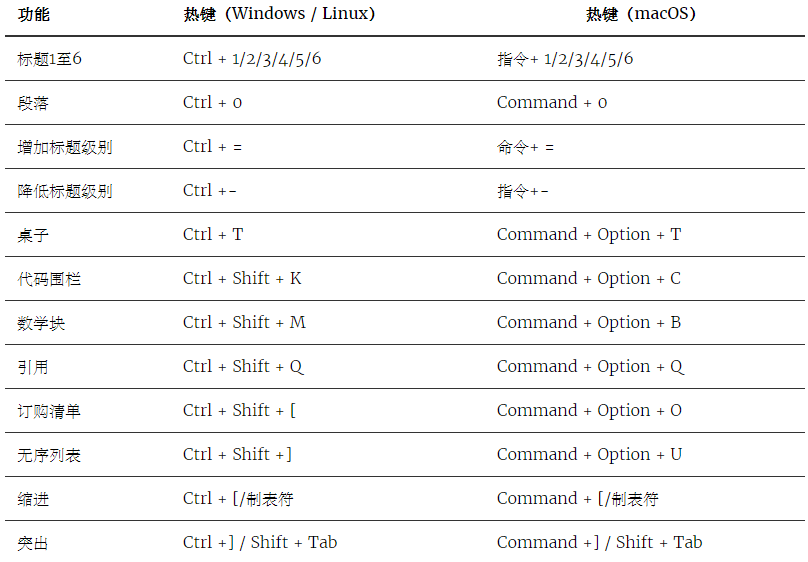
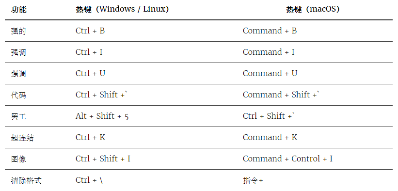
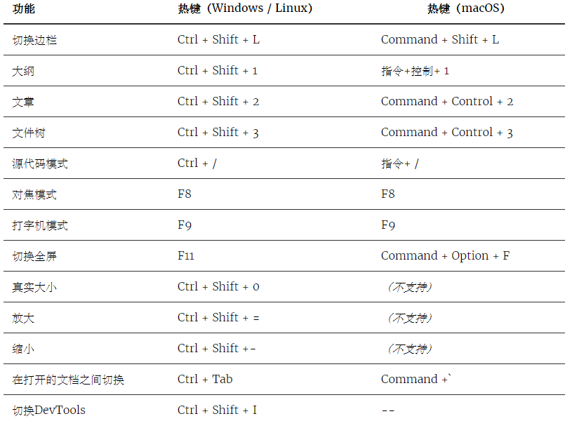

# 目录

[TOC]


# 第一章 多级标题


## 1.1 创建多级标题

1. 快捷键--------Ctrl+1~6
2. Markdown语法：  N个#+空格   

一级标题---#空格 、Ctrl+1

二级标题---##空格 、Ctrl+2

三级标题---###空格 、Ctrl+3

四级标题---####空格 、Ctrl+4

五级标题---######空格、Ctrl+5

六级标题---######空格、Ctrl+6

要将标题还原为段落 --- Ctrl+0、Ctrl+此行等级    或是在光标移动到标题前点击BackSpace（相当于删除了#后面的空格）

## 1.1.1 具体操作

1. 写完一行标题，再在此行操作Ctrl+0~6或者再在前面加"# 空格",就可以把此行变成标题/还原标题。或者先Ctrl+1，此时左边也许出现一个“h2”的半透明字体，但是能看到光标明显变大
2. 也先直接以#空格   或   Ctrl+N 开始
3. 光标停在非一级标题行时 会显示“h2”的半透明字体 可以参考这个来定义接下来的标题等级-有时不显示

#### 注意

1. #后一定要有空格
2. 只有最多6级标题
3. 三级标题依旧能通过Crtl+4修改为四级标题（而在三级标题前加#####空格的方法无法修改）
4. 删除标题的文字后，会发现还保留光标的大小，此时此行格式依旧是标题格式
5. Ctrl+0只能对单一行操作，不能还原 多个标题
6. 将已经创建好的标题文字中间进行回车，则回车到第二行的内容保留了标题格式

# 第二章 有序列表


以把大象装进冰箱为例子

## 2.1 创建有序列表

1. 快捷键-----Ctrl+Shift+[
2. Markdown语法：  1. 空格   

#### 实例

1. 打开冰箱----- 1.空格 （会发现整行后退了一格） 一定要有空格
2. 把大象放进冰箱----在有序号的那行回车   则下一行自动添加序号
3. 关闭冰箱

-----------------如果从第三行回车依然会产生序号。

#### 注意

1. 在有序列表停止自动添加序号后另起一行所创建的有序列表和上一个列表是两个不同的列表（两个列表间距离增大）

## 2.2 停止自动添加序号

1. 再次回车；
2. Shift+Tab 升级这个序号
3. 直接在第三行点击 向下的箭头；
4. 鼠标点击下一行  就可以取消自动添加序号的功能。而删除键没有用（删除过后还保留了一些空格，再次删除就又回到上一行了）

#### 注意

1. 有序列表前面的序号删除后依旧存在缩进   无法删除此缩进（或许在两段有序列表中间不能插入无序号的段落）

4. **在嵌套的有序列表停止自动添加符号，光标并没有返回到页面边缘，而是与上一级序号对齐，此时再次回车就又继续上一级的序号。再再此空格则又与上上级序号对齐……**
1. 有的时候做的多级标题无法显示在大纲内，或许就是因为光标没有回到页面边缘，
      而且此时即使回车也不显示它所对齐的那个序号。
   2. 其实最暴力且保险的方法是不断升级序号，就可以删除所有空格
   3. 或者在下文有空白的情况下点击下面的几行，就可以直接点到最前面

   1. 示例
      1. 打开冰箱
      2. 进口大象-----插入一行会自动添加序号
      3. 把大象放进冰箱
      4. 关闭冰箱
         1. hhajfn
            1. hdfiafna
               1. hanfa----------从这里两次回车又继续上一级序号

## 2.3 在一个有序列表中插入插入、删除一行

1. 在其中任意两行之间插入都会自动添加序号并且修改其余所有行的序号

2. 相应的在删除任意一行，也会相应改变

### 示例

1. 打开冰箱
2. 进口大象-----插入一行会自动添加序号
3. 把大象放进冰箱
4. 关闭冰箱

## 2.4 在有序列表中嵌套有序列表

### 2.4.1 降级快捷键

快捷键-----Tab 、Ctrl+[  

1. 打开冰箱
   1. 插电-----三行全选，再Tab就可以一起后移并重新生成列表
   2. 开机-----注意：这里多次Tab，也只能降一级，这和目前有多少级有关
   3. 开门
      1. 握住把手
      2. 往后拽
2. 进口大象
3. 把大象放进冰箱
4. 关闭冰箱

### 2.4.2 升级快捷键

快捷键---shift+Tab 、Ctrl + ]

1. 打开冰箱
   1. 插电
   2. 开机
   3. 开门
   4. 握住把手（本属于开门环节中的操作）-----选中两行之后Shift+Tab即可升级
   5. 往后拽（本属于开门环节中的操作）
2. 进口大象
3. 把大象放进冰箱
4. 关闭冰箱

#### 注意：

1. 当降/升级的多段文字中同时包含两级以上序列，每一级都顺应降/升一级
2. 选择整个有序列表升级，结果都没有序号

## 2.5 对多段文字生成或取消有序列表序号

选中多段文字再----Ctrl+Shift+[    

##### 示例

1. 打开冰箱
2. 把大象放进冰箱
3. 关闭冰箱

##### 注意

这里如果只选中五个无序列表中的三个

- 青菜
  - 白菜
  - 茄子
- 水果、、、、、、、、、、
- 苹果----只选中三行将他们定义为有序列表时，所有同级的无序列表都会变成有序列表
- 梨子、、、、、、、、、、
- 菠萝
- 肉

# 第三章 无序列表

## 3.1 创建无序列表

1. Markdown语法：*空格   或   - 空格       ---  生成项目符号 
2. 快捷键---shift+Ctrl+]

### 注意

1. 一定要有空格
2. 一定是在首字符前，在句中没用

## 3.2 无序列表的插入删除

1. 无序列表的操作和有序列表相同
2. 以及取消接下来一行的自动添加符号  的操作相同

* 青菜
* 大米
* 水果
* 肉

## 3.3 无序列表中嵌套无序列表

-----和有序列表操作相同

### 3.3.1 降级快捷键

----Tab 、Ctrl+[  

### 3.3.2 升级快捷键

----Shift+Tab 、Ctrl+ ] 

## 3.4 有序列表可以与无序列表交错使用

#### 实例

* 青菜
* 水果
* 苹果、、、、、、、、、、、
* 梨子-----首先将三行升级Tab，再Shift+Ctrl+[ 一起排序
* 菠萝、、、、、、、、、、、
* 肉

结果如下：

* 青菜
* 水果
  1. 苹果
  2. 梨子
  3. 菠萝
* 肉

#### 注意

1. 必须要升级

## 3.5 对多段文字生成或取消无序列表符号

选中多段文字再----Ctrl+Shift+  ]    

* 青菜
* 水果
  1. 苹果
  2. 梨子
  3. 菠萝
  4. 进口菠萝---选中两行降级，再shift+ctrl+]  
  5. 国产菠萝
* 肉

#### 注意

1. 无论是有序还是无序列表，选择五个同级序号中两个进行操作，则全部同级的都会执行相同操作
   因此需要单独操作时，提前进行降级

# 第四章 任务列表

## 4.1 创建任务列表

Markdown语法： -  空格 [ 空格 ] 空格  -----生成任务列 表  （ *  空格  [  空格  ]  空格也行）

CSDN中提供：Ctrl+shift+C作为快捷键（Typora的此快捷键时以Markdown形式复制)

#### 注意

1. 中括号必须是英文的

#### 实例

* [x] 早晨8点起床
* [ ] 中午一点吃饭
* [ ] 下午7点吃饭

* [ ] 学习-------因为这是另起一个任务列表，所以与上一个列表间隔变大

1. 停止自动添加符号、插入、删除某一行的操作与有序/无序列表相同

# 第五章 插入表格

## 5.1 操作格式

1. 快捷键-------Ctrl+T     ---  需要填写行列数，再依次填写表格
2. Markdown语法：
   1. 表头的创建：  |学号|姓名|性别|年龄|  +回车  
      1. 注意：中间没有空格，有空格的话会被作为表格创建出来
   2. 第一行： 随着表头一起被创建
      - 填写：tab键可以切换到下一个格子，或用箭头操作
      - 删除操作：Ctrl+Backspace 能够删除一个格子内所有信息，如果该表格已空则跳转至上一个格子
   3. 继续第N行（N>=2）：在N-1行任意格子内   Ctrl+Enter ，  否则直接跳出表格
   4. 跳出表格：
      1. 鼠标点击表格以外
      2. 向下的箭头
      3. 回车


#### 示例

| 学号 | 姓名 | 性别 | 年龄 |
| ---- | ---- | ---- | ---- |
| 190  | NJ   | 男   | 21   |
| 190  | SSR  | 女   | 19   |

## 5.2 对表格进行操作

1. 利用表格自带菜单

   只要光标停留在表格内就会显示

   1. 左侧
      1. 调整表格大小 -----  先择的表格比当前的小，被挤出去的数据就全没了
      2. 对齐方式 ------ 调整的是  光标所在的列
   2. 右侧的菜单 ------------ 在表格内右键有相同的菜单选项
      1. more actions：
         1. 删除列和行  取决于光标所在位置
         2. 格式化表格源码，目前还不懂
      2. 删除表格

# 第六章 行内代码

1. 快捷键------Ctrl + shift + `  --------  快捷键输入时，不要求反引号的英文格式

2. Markdown语法

      ~~~
      语法：  `行内代码`   -----   ` 与文字间 之间可以有空格 ,但这些空格不会显示出来
      ~~~

      1. 注意，这里的反引号只能由英文输入法打出来

3. CSDN中没有快捷键

#### 示例

~~~
`我的    `
`使用快捷键创建行内代码`
`使用Markdown语法创建代码`
~~~

#### 效果

1. ` 我的     `
2. `使用快捷键创建行内代码`
3. `使用Markdown语法创建代码`

# 第七章 代码块

或叫“代码围栏“---作用是提供写代码的环境

需要提前进行设置：


## 7.1 创建代码块

1. 快捷键  -----------   Ctrl+shift+K  

2. Markdown语法 ： 
   ~~~
   ```java回车   或 ~~~java回车
   ```/~~~ 再选择语言再回车
   
   这是CSDN中语法：
   ​~~~
   语法：  
   ​~~~
   ~~~

#### 示例

1. Markdown语法示范

   1. ~~~或``` + 回车  (光标一旦点击其他位置，也会自动提取后面的回车形成代码区)

      1. 首先形成一个代码书写区
         1. 如果此时书写。则只有背景，没有缩进和变色
      2. 再选择语言  --  写完之后选择语言只能变色，需要手动缩进。
         1. 书写时的操作：
         1. ctrl+enter 能够跳出代码区
            2. 删除代码块，需要先删除里面的内容（Ctrl+a），再删除代码区
      
      ```java
      public class HelloWorld{
      	public static void main(String[] args)
      		System.out.println("Hello World");
   }
      ```

      小结：这种方法先选择语言，会更方便。

   2. ~ ~~java  ：相当于上一个方式一二步结合。生成一个能改变颜色和自动缩进的代码书写区

      ~~~java
          public class HelloWorld{
              public static void main(String[] args)
                  System.out.println("Hello World");
          }
      ~~~

2. 或者使用快捷键

   1. 先写出代码   ---   Ctrl+shift+K （相当于~~~）

      1. 先写代码，不能缩进、变色
      2.   先选择语言：能缩进、变色（相当于~~~java形式）

      ```java
      public class HelloWorld{
      	public static void main(String[] args)
      		System.out.println("Hello World");
      }
      ```

## 7.2 代码块的其他用法

~~~text
这是用text格式写的代码块，其实也不用标记text，不填任何语言即可
代码块不一定用于放代码
也可使用作一个段落，进行表达想说的内容
~~~

## 7.3 总结

1. 在Typora中插入代码块 ~~ ~ + 语言 最方便；如果选择Ctrl+shift+K、~~~或 ```   只要出现代码区就直接选择语言，也能变色和缩进
   1. 而CSDN中~ ~~和 ```都会被误认为是删除线操作和加粗操作（会不会被误认为时其他操作，需要看前后有误~或"反引号"，所以在CSDN中快捷键更方便。
2. 这 ~~~（java） 或者```（java）只会在其处于段首时变成代码块。而且三个~与三个"反引号"后面不能再接相同符号，否则会被认为是删除线和加粗操作
3. CSDN中对代码块再次进行Ctrl+shift+K 无法复原
4. 如果是从外部复制一个没有缩进的代码到代码块内，无论是否那种方式，在这里只能变色，还需手动缩进

# 第八章 插入图片

需要提前设置：



1. 复制图片到 .assets 文件中的原因：由于Typora的 .md 文档并没有保存图片，而只是调用。所以对于插入的图片插入的图片需要保存到一个文件中，而生成 .assets 文件能够清晰整理出不同文档所需要的不同图片
2. 相对路径：此时移动 .md 文档时 只要保证 .assets文件夹和它处在同一文件夹下即可调用到

## 8.1 插入图片

1. 快捷键-----Ctrl+shift+ i  

   1. 也可以截图在剪切板中，再Ctrl+V 导入

2. Markdown语法：

   ~~~
   ![] ()  ----------   必须是英文符号
   ~~~

3. [  ]   是用于输入图片名称、(  )  适用于输入地址(可以是本地的、云端网址) 。但是在.assets文件夹中图片名没有修改

4. 其他操作（缩放图片等）：点击图片后右键

5. 图片位置应该只能在正中间


​					有输入名称的图片：

~~~
语法：  
~~~


## 8.2 实现云笔记

1. 会使用Github或Gitee，首先在Github/Gitee上创建一个仓库----TyporaNote

2. 依靠链接将仓库克隆到本地。为了实现本地与Github的同步

   （当然实现本地和Github同步方式不止一种）

3. 之后将已经创建好的笔记文件夹（如果采用相对路径的话，此时笔记文件夹内也有.assets文件夹）、或者直接在本地TyporaNote文件夹内创建笔记文件夹

4. 当需要更新云端（Github）上的笔记时，采用如同上传本地代码的方式，来更新云端笔记。当然，在一台新的电脑上只需要依靠Github从云端将笔记拉下来即可

5. 如果是想复制Typora笔记到CSDN之类的网站，插入的本地图片可能就会找不到。此时，如果本地有就可以在CSDN种手动插入该图，没有的话可以从Github上拉下来

6. 如果不想手动插入，可采用 8.3 插图的云托管

## 8.3 笔记插图的云托管

1. 就在这篇文章写完不久，看到一篇 [文章 ](https://www.jianshu.com/p/c7618a53454f)介绍如何用Github托管图片的（上面Github云笔记不能得到图片链接）。我就尝试了一下，果然可以，而且我改良了步骤，能让Github上不同的图片在应该在的文件夹内。静待后续更新------------我应该懂了，GitHub上是可以创建.md文档的，所以托管等一系列操作是本来就可以实现的
2. 由于我个人认为托管的可靠性有待商榷，毕竟不是自家的，而且还免费，曾经听到句话“免费的往往是最贵的”
3. 具体如何云托管，我并未深入研究。这里提供一个视频链接，大家觉得哪种适合自己就用哪种
   [随处可用的Markdown文档](https://www.bilibili.com/video/BV16t4y1a7j3)
4. 对于Github不熟悉的，之后我会再发专栏详细介绍

# 第九章 官网快捷键 

[官网快捷键网页](https://support.typora.io/Shortcut-Keys/#frequently-used-shortcut-keys)

## 9.1 文件



1. Ctrl+N 所创建的笔记默认是在当前笔记同文件夹下
2. Ctrl+shift+N 创建的笔记没有默认文件夹
3. Ctrl+O 之后需要在电脑中选择打开的笔记
4. Ctrl+P 是打开了快速搜索窗口，方便快速找到文件夹
5. 偏爱----即偏好设置

## 9.2 编辑



1. Enter---新段落    即  再开始一段
2. Shift/Ctrl+Enter---新队 即   开始新的一行（此时并没有进入下一段，所以  有序列表标号等标记 并不会变化）
3. Ctrl+X---切  即   剪切
4. Ctrl+Shift+C---复制为减价  即  Copy As Markdown  -------- 具体作用不明
5. Ctrl+L---选择行，就是将光标所在行全部选择
6. Ctrl+E---选择样式范围---即选择光标所在单元格
7. Ctrl+D---选择单词，不是单词的会选择符号之间的内容
8. Ctrl+home---跳到顶部
9. Ctrl+End---跳到底部
10. Ctrl+j---跳转到光标位置
11. Ctrl+F---查找

### 额外补充

1. PgUp先会跳到光标所处位置，再一页一页往上走
2. PuDn先会跳到光标所处位置，再一页一页往下走

## 9.3 段落



1. Ctrl+0---变成段落
2. Ctrl 加 +/=  ---  增加标题级别
3. Ctrl+T---表格
4. 数学块、引用暂时不知道怎么用

## 9.4 格式



1. Ctrl+B---加粗  或  右键 --- 选择加粗

2. Ctrl+I---倾斜

3. Ctrl+U---下划线

4. Ctrl+shift+`---行内代码

5. Alt+shift+5 ----- 删除线

6. Ctrl+K ----  超链接

   1. 复制进来的网址，会自动生成超链接 --- 仅限于 Typora

      1. 语法：（当你的光标停留在一个单词，再Ctr+k时，就会对这个单词进行超链接）

         ~~~
         [百度一下](www.baidu.com)
         ~~~

      2. 效果：  [百度一下](www.baidu.com)

7. Ctrl+\ --- 除了对代码块无法清除格式，其余的均可以复原

   1. 上面一些操作的Markdown语法

      ~~~
      **这是粗体**-----注意：第一个**后不能有空格，而第二个**前可以有空格
      ~~这是删除线~~
      <u>这是下划线</u>
      *这是斜体*
      ~~~

## 9.5 浏览



1. Ctrl+shift+L---显示/隐藏侧边栏，其状态还是上次隐藏的状态
2. Ctrl+shift+1 ---- 显示大纲
3. Ctrl+shift+2 --- 文件栏切换为文档列表模式
4. Ctrl+shift+3 --- 文件栏切换为文档树模式
5. Ctrl+/ --- 切换至源代码模式
6. F8 --- 对焦模式：光标所在行高亮，F8结束或在视图菜单中关闭
7. F9 --- 打字机模式：输入空间不足时，下方布局不动，上面文字向上移动
   1. 正常情况下，笔记上往上移动还是往下看你光标所在位置，
8. Ctrl+shift+o ---  点击没看到反应
9. Ctrl+tab 切换Typora窗口   -----    Alt+Tab --- 切换所有工作窗口
10. Ctrl+shift+ I ----不知道干嘛，且与插入图片冲突

# 第十章 其他操作

1. 区别显示：

   1. 语法：shift+. 形成 > 再空格，就出现了 

   > 这个不能出创建在非首字符的位置 ，且能嵌套区别显示
   >
   > > 这里必须些内容，否则回车之后，这一个 | 就没了
   > >
   > > > 

2. 分割线：

   1. 语法：---回车（必须在首字符位置）

3. 脚注  -----  在CSDN中脚标显示在文章最下面，且用了分割线分开。在Typora导出的PDF中，脚注也在文章最下面

   1. 语法：

      ~~~
      我是谁[^备注标签]
      [^备注标签]:备注内容
      ~~~

   2. 效果：我是谁[^备注]

      [^备注]:大帅哥

4. 目录：

   ​	操作：右键--插入--内容目录，就可以插入一个目录（大纲）

# 终章 总结

1. 由于Typora默认是以文件夹为单位管理笔记，所以创建不同文件夹来存相应笔记
2. 同样的一个快捷键，用在一个对象上两次，就会恢复原状
3. 对于不同的主题，有些会自动在一级标题下自动添加下划线
4. 非首字符的位置，任何#空格、1.空格、*空格 都没有语法作用的

## 1. 实现操作的三种方式

1. 有些操作频繁，因此具有快捷键Ctrl+1；
2. 所有操作都可以通过以下两种方式实现  
   1. 点击菜单
   2. Markdown语法

## 2. 右键菜单

在不同位置右键，能打开不同菜单，这些菜单几乎满足所有需要

1. 无论目前能学多少，都需要在实践中不断补足
2. 加黑、添加代码块时，光标从操作的对象上移开，操作的效果才能显现出来

# 附录1：多设备查看笔记

1. 首先，目前我没找到手机上的Markdown语法APP，如果哪天找到了，或许也需要解决同步这个问题
2. 因此，不妨尝试一下直接导出PDF格式。在移动端，虽然只能简单做标记，我想这已经足够了。因为我一般就是用移动端进行复习的，偶尔做做标记，等到打开电脑再更改也不迟。
3. 或许Markdown确实不适合用APP，毕竟命令有些多。（也不能一棒子打死，程序员的能力绝对可难以想象的！！）