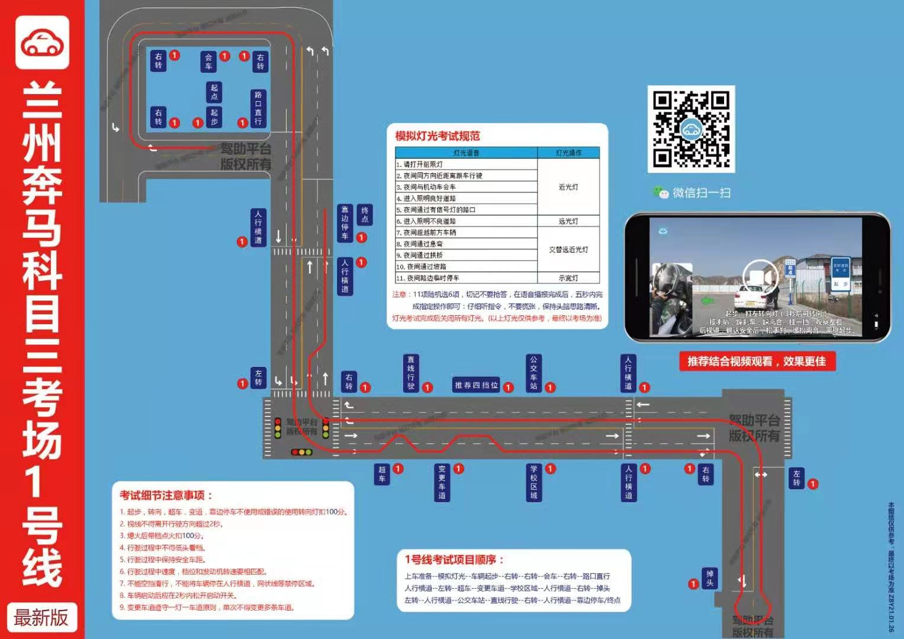

### 问题: 

*  30公里以上速度行驶750米是什么项目.
* 直线行驶语音播报的吧?
* 后溜30厘米不合格/好像是扣分
* 第三个右转走哪条道好（左边？）

---

细节: 

* 刹车：
  * 有提示音: 斑马线 / 左转 / 右转箭头根部 / 路口 
  * 无提示音: 公交车站 / 会车 / 学校[不确定点不点刹车]
* 转向灯：(技巧: 报信号立刻考虑转向灯, 不能光等着点刹车)
  * 有提示音: 左转 / 右转[后两个] / 变道 / 掉头 / 变道 / 超车(变回来时没有提示音,自己打左灯)
  * 无提示音: [前三个]右转 / 自主变道[学校后斑马线前]
* 连续变道
  * 变道后默数10秒

#### 行驶路线

1. 上车顺序:
   给卡 -> 逆时针(五秒,听提示音,顺便看看车门关紧) -> 上车 -> 调座位 -> 系安全带 -> 检查档位和灯光 

   -> 听语音启动 -> 做灯光测试 -> 关闭灯光 -> 提示起步打左转 -> 调镜子 -> 起步。

2. 第一个右转

   * 起步后左转灯 灭了 直接打右转灯 
   * 点位: 肩膀到铁墙(***不太确定***)

3. **第二个右转**

   * **点位: 车窗右下角快看不到黄线**[这个点位没实践过]

4. 会车: 提示音后只刹车

5. 第三个右转（凭感觉转,***转到左边道路***）

6. 路口: 提示音后只刹车

7. 人行横道: 无提示音, 须刹车

8. 第一个左转凭感觉 .转过去找慢车道

9. 超车

   * 左转灯亮三秒后超车,
   * 然后默数十秒
   * 变回来时没有语音但是要打灯

10. 变更车道后加减档(不出意外,变到了快车道)

11. 加减档: 起点是变道后

    * 加减档***有提示音吗*?**
    * ***升到四档后维持40公里速度,直到学校前?***

12. 学校前70、80米从加减档的4挡减到1档

13. 自主变道: 位置:学校过去后,斑马线前

14. 人行横道: 无提示音, 须刹车

15. 人行横道到右转路口,不能变车道

16. 掉头: 车头盖住箭头打90°.马路牙子快被遮挡时打死**(关于马路牙子的表述不确定)**

17. 路口左转: 听语音打左转灯,须点刹车

18. 人行横道: 无提示音,须刹车.

19. 750米: 人行横道刹车后加到三档(这段路是弯的)

    * ***速度必须30以上?***

20. 公交车站: 

    * 点刹车（**速度要30以下吗？**）
    * 点位: 车头到蜜雪冰城（树上的）

21. 直线行驶开始提示音: 保持速度,

22. 直线行驶结束提示音: 立刻减速减档

23. 第五个右转看肩膀道牙子

24. 靠边停车: 先打灯

25. 下车顺序：左转灯不动--摘档--拉手刹--熄火--解安全带--开门关门。

---

#### 路线总结

1. 右转：第一个看肩膀铁墙、第二个看车窗、第三个(凭感觉) 、第四个凭感觉、第五个看肩膀与马路牙子
2. **公交车、学校、人行横道 没提示**
3. 加速时机: 加减档 / 左转之后的斑马线减速完成后
4. 减速时机: 学校前70,80米 / 直线行驶结束语音提示后

#### 

