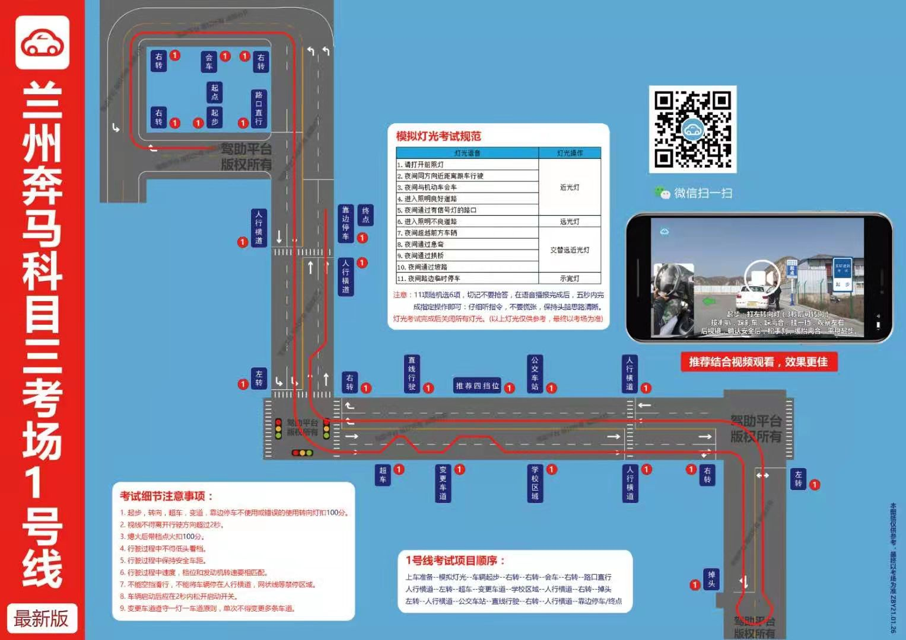

科目三
~~1.右转后-会车 是交替灯光？~~
~~2.直线行驶：一档5s， 二档5s，三档5s，四档也5s？换挡时平稳加速，攒够时间、档位也匹配）~~
~~3.直线行驶中变更四个档位？~~
~~4练车项目：左转、右转、超车、变车道、停车、上车~~
~~5错误使用灯光、带挡打火扣100。那么直线行驶偏移、档位不匹配呢？~~
~~6倒车档位（掉头出错倒车）~~
~~7超车完成后，回去要打右转灯？变道都要打灯？~~
~~8难点：刹车、转向灯。刹车：箭头根部、路口、会车、公交车站（学校只限速？） 转向灯：主要听语音，先转向灯后刹车~~
~~9直线行驶听语音结束，开始时间呢？~~
~~10细节：勿连续变道、刹车轻踩、带挡打火、一档起步、挂档利索、~~
~~11上车顺序：给卡--逆时针（五秒，提示音, 顺便看看车门）--上车--调座位--系安全带--检查档位和灯光--听语音启动--做灯光测试--关闭灯光--提示起步打左转--调镜子--起步。~~
~~12下车顺序：左转灯不动--摘档--拉手刹--熄火--解安全带--开门关门。~~
~~13那几个点位转向灯？~~
~~14第二个右转踩线（有车窗压线）~~
~~15第一个看肩膀~~
~~16灯光错误了（远光调近光，变成了远近交替）~~
~~17 1000转以上，1500转一下（三秒以上就速度档位不匹配）、各个档位的速度匹配、什么速度换挡？~~
~~18前三个右转打灯~~
~~19报信号立刻打灯~~
~~20超车三秒后默数十秒、右转也要打灯~~
~~21学校点两次刹车~~
22~~超车（第二个变回来没有语音但是要打灯）、变更车道、左转、直线行驶都有语音~~
23~~学校完（斑马线前）立刻变道~~
24~~倒车前右转很宽。不用点位~~
25~~掉头（补救倒车），车头盖住箭头打90 掉头路亚子离车窗快到了，打死~~
26~~掉头后左转也要点刹车~~
27~~提速的时候稳住1200转，不要加速太快~~
28~~加减档，起点是个箭头？起点是变道后~~
29~~直线行驶结束立刻减速减档~~
30~~加减档后的右转看肩膀.这个右转很宽,不要看~~
31~~右转：第一个看肩膀铁墙、第二个看车窗、第三个（凭感觉） 、第四个凭感觉、第五个看肩膀道牙子~~
32~~起步后左转灯灭了直接右灯~~
33~~前三个右转无语音打灯~~
34路口直行语音是点刹车
35~~变更车道后加减档~~，
~~学校前7、80米减速~~
~~36~~第一个~~左转凭感觉，车头快要压线。找慢车道~~~~
     ~~第二个左转前排除障碍（车辆）再右转。不能变车道~~
38~~细节：低速的时候看车底箭头，为了能点刹车。耳朵听语音，为了能打转向灯~~
39~~车头到蜜雪冰城（树上的）代表公交车站点刹车（速度要30以下吗？）~~
~~40公交车、学校、人行横道 没提示~~
41最后，~~靠边停车（是在车身压过人行横道箭头提示）先打灯，这时候别停车。停车需要在离箭头挺远的时候等前面的车~~
42~~换一档是降到20以下，比较平稳。靠发动机制动会扣分？~~
43~~后溜扣分（倒车补救不也后溜了？）~~
44第三个右转走哪条道好（左边？）
45学校完了，自主变道？

