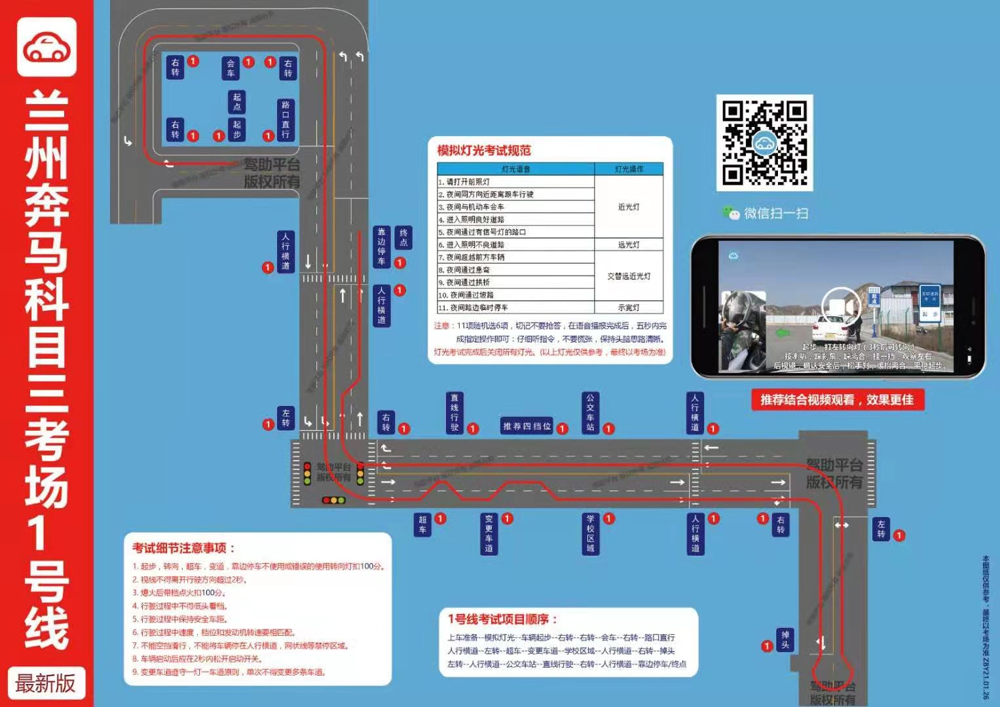

### 问题: 

1. 右转后-会车 是交替灯光？
   * 回车本来就只是轻点刹车.双闪从来就是错的.
2. 直线行驶：一档5s， 二档5s，三档5s，四档也5s？
   * 是的, 并且换挡时平稳加速，才能保证攒够时间 / 档位也匹配
3. ***直线行驶中变更四个档位？(有疑问)***
   * ***根本问题: 30公里以上速度行驶750米是什么项目.***
   * ***问题1:人行横道结束后的提速上三档,是否算是直线行驶?***
   * ***直线行驶语音播报的吧?***
4. 错误使用灯光 / 带挡打火扣100。那么直线行驶偏移 / 档位不匹配呢？
   * 都是不合格
   * ***后溜30厘米不合格/好像是扣分***
5. 超车完成后，回去要打右转灯？变道都要打灯？
   * 都要打灯
6. ***直线行驶开始和结束有提示音?***
7. 1000转以上,1500转以下（2000转三秒以上就速度档位不匹配）
8. 各个档位的速度匹配? 什么速度换挡？
   * 看下面的挡位
9. 提速的时候稳住1200转，不要加速太快
   * ***提速主要看 转速?而不是看车速***
10. 换一档是降到20以下，比较平稳。靠发动机制动会扣分？
    * 待
11. 第三个右转走哪条道好（左边？）
    * 待

---

#### 平时练习

1. 练车项目：左转 / **右转** / 超车 / 变车道 / **停车** / 上车, 加减档(提速的节奏,换挡利索) ,直线行驶

---

#### 需要补习

1. 掉头出错倒车法(倒车档位怎么挂?）.算不算后溜?
2. 灯光错误了（远光调近光，变成了远近交替.语音一定听准确）

---

#### 难点

1. 细节: 
   1. 灯光测试: 语音一定听准确,不用急着做动作,想清楚
   2. 刹车：
      1. 有提示音: 斑马线 / 左转 / 右转箭头根部 / 路口 
      2. 无提示音: 公交车站 / 会车 / ***学校(前后都点一下,都不点也行)***[有疑问]
   3. 转向灯：(技巧: 报信号立刻考虑转向灯, 不能光等着点刹车)
      1. 有提示音: 左转 / 右转[后两个] / 变道 / 掉头 / 变道 / 超车(变回来时没有提示音,自己打左灯)
      2. 无提示音: [前三个]右转 / 自主变道[学校后斑马线前]
   4. 连续变道
      1. 变道后默数10秒
   5. 刹车轻踩
      1. (***到底是检测刹车灯亮了吗,还是检测速度降了吗,还是只看刹车动没动不清楚***)
      2. 一档没给油稍微轻点就行
      3. 给油的时候,刹车允许稍微用力
      4. 真的要减到很低,直接离合刹车一起
   6. 带挡打火(熄火后放松,没有时间限制)
   7. 一档起步(路况不是特别阻塞,不要挂回空挡)
   8. 挂档利索(三减一的时候)
   9. 加减档 / 750米 / 直线行驶 过程中油门稳住.注意转速(转速和车速有联系,转速1200即合适)
   10. 降档时,一定把速度降到20以下
   11. 换挡:
       1.  平稳加速，才能保证攒够时间 / 档位也匹配
       2. 提速的时候转速1200转，不要加速太快
   12. 

#### 行驶路线

1. 上车顺序:
   给卡 -> 逆时针(五秒,听提示音,顺便看看车门关紧) -> 上车 -> 调座位 -> 系安全带 -> 检查档位和灯光 

   -> 听语音启动 -> 做灯光测试 -> 关闭灯光 -> 提示起步打左转 -> 调镜子 -> 起步。

2. 第一个右转

   * 起步后左转灯 灭了 直接打右转灯 (不自动灭就直接拨到右转灯)
   * 点位: 肩膀到铁墙(***不太确定,看14号练习情况,能否凭感觉***)

3. **第二个右转**

   * **点位: 车窗右下角快看不到黄线**

4. 会车: 提示音后只刹车

5. 第三个右转（凭感觉转,***转到左边道路***）

6. 路口: 提示音后只刹车

7. 人行横道: 无提示音, 须刹车

8. 第一个左转凭感觉，车头快要压线[马路牙子] .转过去找慢车道

9. 超车

   * 左转灯亮三秒后超车, 
   * 然后默数十秒
   * 变回来时没有语音但是要打灯

10. 变更车道后加减档(不出意外,变到了快车道)

11. 加减档: 起点是变道后

    * 加减档***有提示音吗*?**
    * ***升到四档后维持40公里速度,直到学校前?***

12. 学校前70、80米从加减档的4挡减到1档 (注意观察学校提示牌)

13. 学校前后点两次刹车

14. 自主变道: 位置:学校过去后,斑马线前

15. 人行横道: 无提示音, 须刹车

16. 人行横道到右转路口,不能变车道(除非已经在快车道)

17. 第四个右转很宽,不用点位. 

18. 掉头（***补救倒车法***）: 车头盖住箭头打90°.马路牙子快被遮挡时打死**(马路牙子距离不确定)**

19. 路口左转: 听语音打左转灯,须点刹车

20. 人行横道: 无提示音,须刹车.

21. 750米: 人行横道刹车后加到三档(这段路是弯的)

    * ***速度必须30以上?***
    * **三档最高速度是多少?**

22. 公交车站: 

    * 点刹车（**速度要30以下吗？**）
    * 点位: 车头到蜜雪冰城（树上的）

23. 直线行驶开始提示音: 保持速度,

24. 直线行驶结束提示音: 立刻减速减档

25. 第五个右转看肩膀道牙子

26. 靠边停车（提示音在车身压过人行横道箭头发出）**先打灯**.语音一出,就别停车,停车需要在离箭头挺远的时候等前面的车

27. 下车顺序：左转灯不动--摘档--拉手刹--熄火--解安全带--开门关门。

---

#### 路线总结

1. 右转：第一个看肩膀铁墙、第二个看车窗、第三个(凭感觉) 、第四个凭感觉、第五个看肩膀马路牙子
2. 低速的时候看车底箭头，为了能点刹车。耳朵听语音，为了能打转向灯
3. **公交车、学校、人行横道 没提示**
4. 加速时机: 加减档 / 左转之后的斑马线减速完成后
5. 减速时机: 学校前70,80米 / 直线行驶结束语音提示后

---

#### 挡位(没找到统一回答)

1. 我学的: 20升二档	30升三档	40升四档

| 挡位 | 范围   | 换挡时机 |
| ---- | ------ | -------- |
| 一档 | 0~20   |          |
| 二档 | 10~30  | 15~20    |
| 三档 | 20~40  | 25~30    |
| 四档 | 30~50  | 35~40    |
| 五档 | 50以上 | 45~50    |

