# 第一位 分享者

## 1.了解竞赛内容

1. 官网找《竞赛说明》
   1. 分享者提供的考察范围图片

   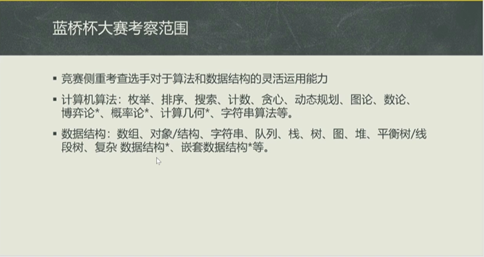

2. 看近几年的题目

   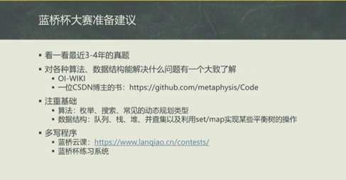

3. 竞赛题目选讲

   1. 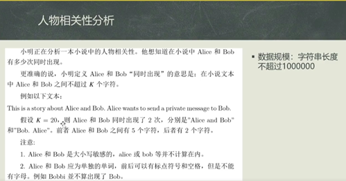
      - （这个讲解在视频P1 25分钟左右）（知识点：滑动窗口）
   2. 
      - 知识点：哈希表
   3. 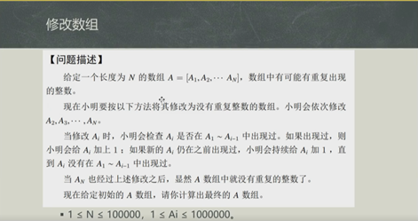

# 第二位 分享者

## 2.1 找目标

- 有一位大佬作为目标及努力的方向、借鉴

## 2.2 竞赛的准备节奏

- 图片讲解

  

- 书籍：《啊哈，算法》

# 第三位 分享者

## 3.1 备赛过程

- 图片介绍

  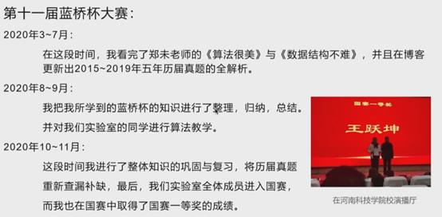

## 3.2 学习工具

- 截图

  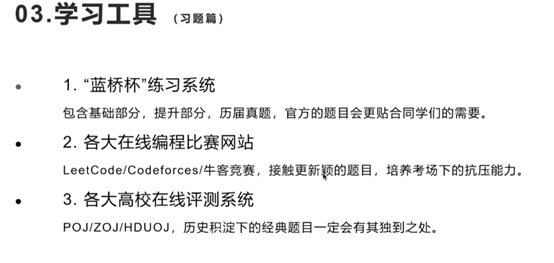

# C组分享者

## 1.1 考察范围

- 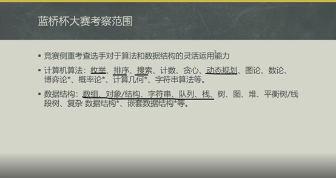

## 1.2 备赛建议

- 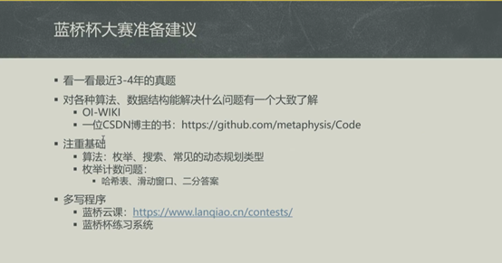

```
可以先了解一下算法的用处，再学习
```

## 1.3 选题讲解

1. 动态规划经典题型：数字三角形、最长上升子序列、最长公共子序列

   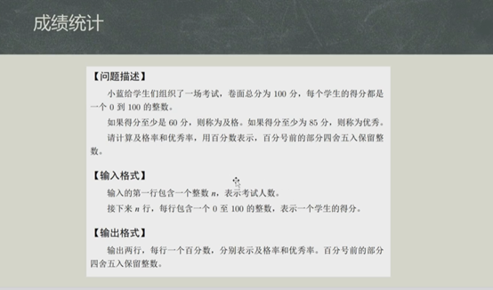

2. 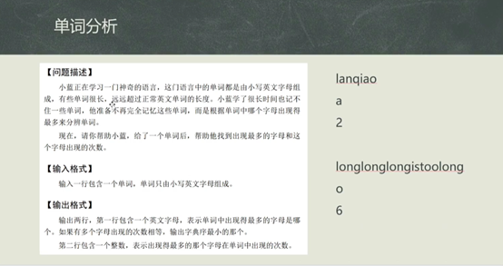

   - （该题比较简单可以尝试写出来，另外整理一下  “找出数组中最大值的算法“ ）

3. 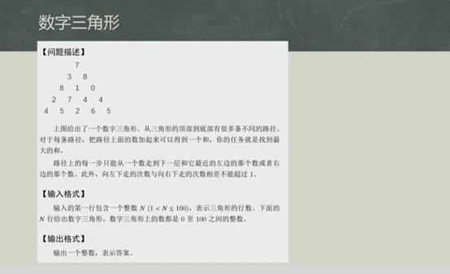

4. 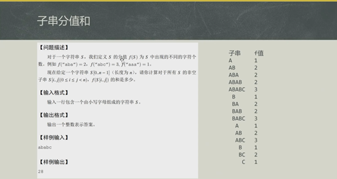

## 1.4 学习规划建议

~~~
学习C语言 是大部分高级语言的基础 不管是C# JAVA C++等等都是以C为基础 学会C，这个所谓的学会，如果只是简单的知道一些语法，会简单的写一些小程序，1-2各月就够了，但是要真正的到那种用C开发程序做商业项目，其实要比用C# JAVA 等更高级的语言还要难，C语言是偏向底层 硬件的语言，所以要到这种程度那估计得花个3年5载吧 而如果是想学会用C#或者JAVA等高级的应用语言开发的话，C语言也至少得学习半年到1年左右然后学习C#或者java本身的一些语法、特性等，（2各月——6个月）然后学习C#或者JAVA的开发类库，组件，控件（1年——3年） 现在差不多你就可以自己做一些小项目 慢慢积累经验（1年——2年） 接着你就可以进入IT公司，而且起薪不低 从一个什么都不会到一份职业 最快 3年左右
~~~


