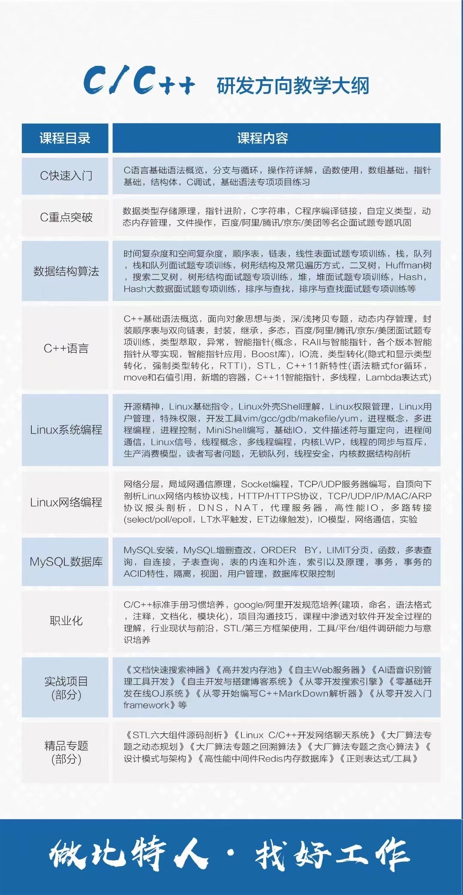
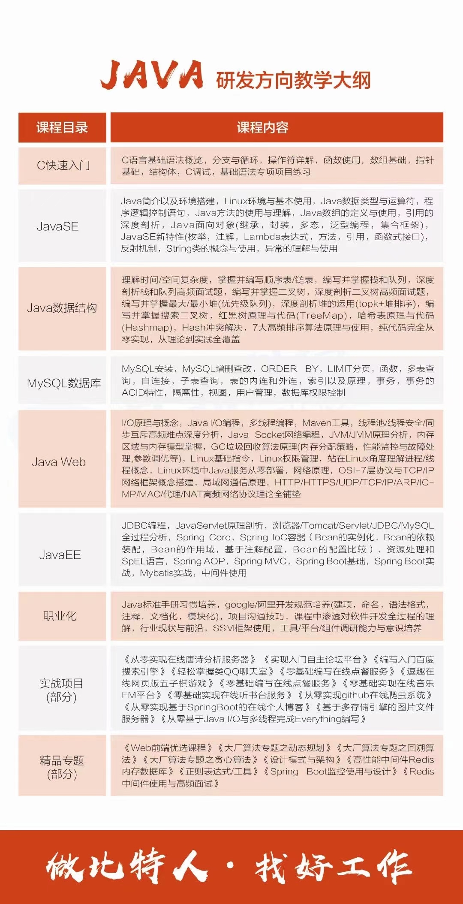
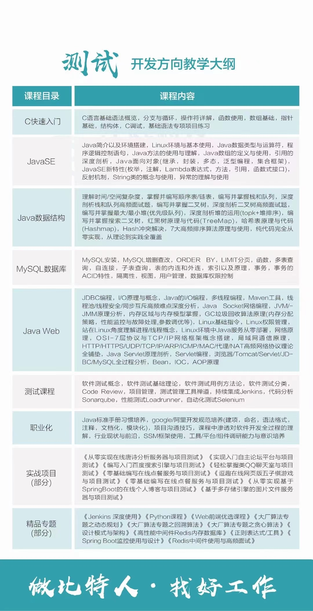
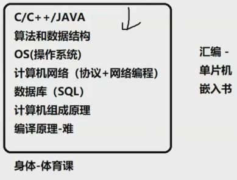

1. 计算机网络

2. 数据库

3. 学习Linux前要学习操作系统

   

比特培训班有两张图

比特科技的推荐路线

三：阶段性目标

3.15-4.18 -- 蓝桥杯 初步学完 C和数据结构与算法、能够了解不同算法的应用场景、适当刷题（稍微整理刷过的题目）

4.18-6.1 -- 将 C和数据结构与算法 重新学一遍、掌握学到的算法、能够（多种方法）解决（并讲解）中等一下的题目

、浏览剑指offer等书籍

6.1-7.25 -- 准备期末考试

7.26-9.1 -- 掌握C# 会用C#刷题

9.2-12.1 -- 掌握Java、突破算法题中困难模式

项目……

 

1. 参考规划：Acwing的活动中有教学目录，可以当作是以后学习的规划https://www.acwing.com/activity/

# github上传的规划--2021.3.15

## 选择原因及规划

### 	为什么打算转专业

1. T 行业太看重技术了，这也是我为什么想要转到这个行业的原因。（更多是因为，这个行业的信息相对容易获取，互联网毕竟
   是 IT 行业打造出来，这上面不乏关于 IT 相关的信息。这让我这个不太外向的人来说再合适不过了。

2. 面对这个没有任何指导老师的专业，我知道光凭努力是远远不够的，更需要的是对未来的规划。
   一：截至目前 2021/3/15 我所学习了哪些有关于计算机专业的知识

### 目前进度  ----  2021.3.15

1. C语言--这是大一我所在专业（也是大多数专业必学的基础课）。但是，我也只是刚刚入门C语言而已，虽然
   	也是学了一遍 《比特鹏哥C语言》https://www.bilibili.com/video/BV1oi4y1g7CF ，但是有一半课程都是以3倍速
   	看完的。前面的课程因为是在寒假有充足的时间学习，所以边学边敲代码练习。可是在家里并没有坚持每天学习，
   	算下来寒假有一半都是没有学习的。
2. 《数据结构与算法》--目前找到了一个比较好的视频“数据结构与算法/王卓/严蔚敏”https://www.bilibili.com/video/BV1Fy4y1v7S8?p=28&t=70
   		正在以3倍速浏览。
   1. git 这个我不太懂，应该就是一个软件吧？我看了一个《狂神说Git》https://www.bilibili.com/video/BV1FE411P7B3?p=11&t=176
      暂且是为了上传Github稍微了解一些，没有深入。
  3. 刷题--并没有真正开始刷题，因为有许多算法还没有了解到，以至于别人写的讲解也看不懂。

### 对未来的初步规划

​	因为没有人指导，对未来的就业岗位不是很了解，所以只能慢慢摸索前进道路
​		1.蓝桥杯--因为蓝桥杯我拿到了校级奖项，因此我更努力学些了。虽然我拿奖纯属因为当时比赛机房联网了。
​	虽然从我目前的了解来看，蓝桥杯等各类比赛，如果不是能拿到很好的名次，在就业上帮助不会很大。但是因为
​	这个比赛我就能有个一个阶段性目标，因为这个目标，我就能有紧迫感。而且这个比赛考察的算法，在一定程度
​	上和就业相关。但是未来的比赛可能就不会再多参加了。因为还有其他更重要的就业内容去学习。如果没有动力
​	或者想检测一下自己的能力，还是可以考虑参加一些比赛、训练赛的。
​		2.知识--目前还没有最终确定要学的编程语言（暂且学习C#和Java），不过从一个视频了解到要“横栈”。
​	这一项需要做的最多：
​			1.了解 IT 行业的岗位内容、拿offer所需要的知识点
​			2.针对第一条找学习资料，算法题（b站有许多up上传刷题讲解、各大刷题网站、社区也有分享）
​			3.高效、坚持学习
​			4.整理笔记（编程语言笔记、算法笔记）、博客（整理算法）、双Git
​		3.就业--首先要能够得到面试机会：1.提升知识量，笔试一定拿下；2.做好项目开发、拓宽视野
​		2.面试：暂且没有到达这一步

### 阶段性目标

​	3.15-4.18 -- 蓝桥杯 初步学完 C和数据结构与算法、能够了解不同算法的应用场景、适当刷题（稍微整理刷过的题目）
​	4.18-6.1 -- 将 C和数据结构与算法 重新学一遍、掌握学到的算法、能够（多种方法）解决（并讲解）中等一下的题目
​	、浏览剑指offer等书籍
​	6.1-7.25 -- 准备期末考试
​	7.26-9.1 -- 掌握C# 会用C#刷题
​	9.2-12.1 -- 掌握Java、突破算法题中困难模式
​	项目……

# 2021.4.15

1. 对未来规划第二版

   1. 数据结构与算法比特开课

   2. C语言6000分钟的视频，结尾看完。学习C+

      C+之后数据结构。然后算法。刷题

2. 此时b站上有一个讲解C++推荐书籍的视频。该up也讲了有四门是重中之重。

   1. 所以未来4-6月
      1. 每天平均至少10h学习，则能有600h
      2. 200h整理鹏哥C视频与看完至少C的prime（plus）书籍。
      3. 300h学习C++和数据结构与算法。边学便刷题。另外，Linux和MySQL还有上面up介绍的4门重要的在无聊的时候学一学。